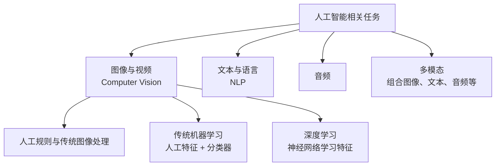
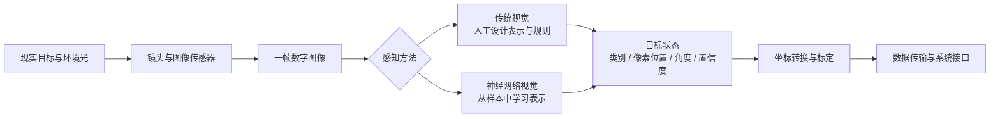
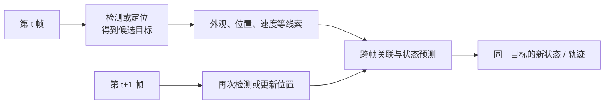
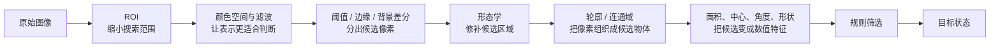
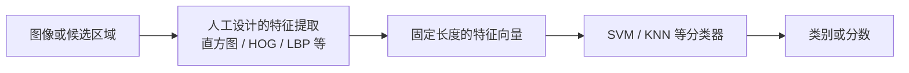
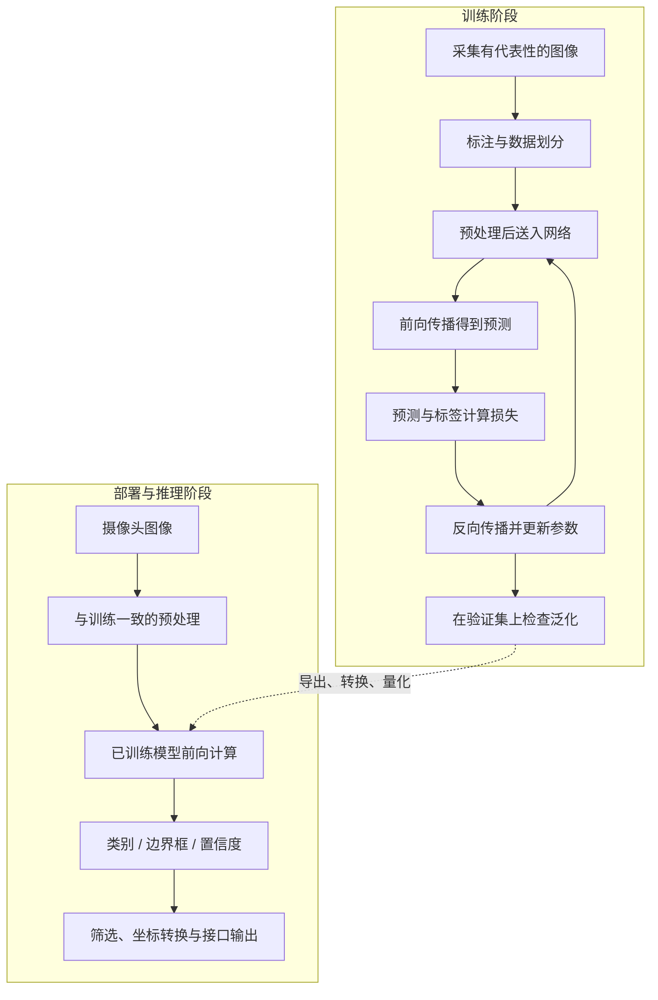
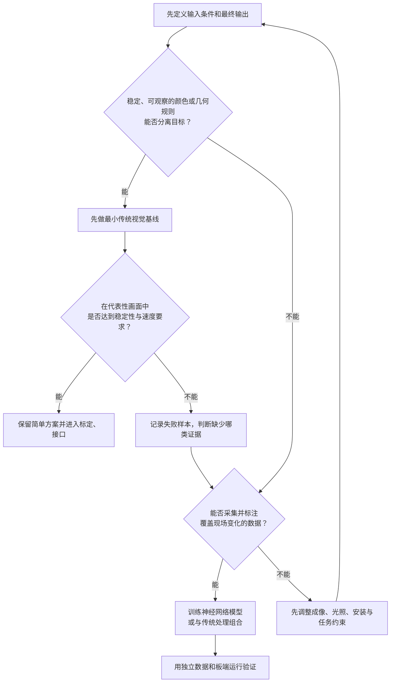
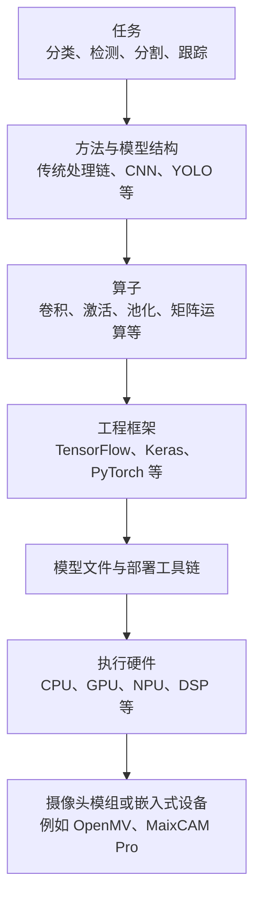

# 一张图像如何变成“物体”：从传统视觉到神经网络

这不是一篇机器学习发展史，也不是算法公式速查。它是一个"序言"，回答一个问题：一张图像进入程序以后，怎样一步步变成可供系统使用的“目标”

这里我要引用我认为《计算机操作系统》最好的网课老师，南京大学蒋炎岩老师课上讲过的一句话帮你理解定位本篇内容：“序言/绪言本质上是对全书的高度浓缩，初学者因为缺乏上下文所以看不懂；但当你真正学完整本书、有了足够的背景知识后，再回头看序言，就会发现它已经把核心思想都说清楚了——只是当时的你还无法理解”，所以你可能读不懂这篇文章，但请你认真读下去，当你学过以后再回来看，说不定会有不一样的收获。

但是我还是期望你在这最开始学习的阶段，读完本文可以得到一个判断方法：看到颜色阈值、轮廓、SVM、CNN、YOLO 或 NPU 时，知道它处在视觉系统的哪一层，解决哪一段问题，而不是把所有名词当成互相替代的“识别算法”。

## 先把视觉放进 AI 地图

这里要分清两个维度：Computer Vision（CV）描述“处理图像与视频”这个任务领域；规则、机器学习和深度学习描述“用什么方法解决任务”。它们不是同一层名词。

本项目只沿图像与视频这一支继续展开。传统方法和神经网络方法都可以解决视觉任务，区别主要在于特征与决策规则由谁设计、从哪里获得。

## 先看完整系统：我们真正需要的不是原始图像

图像只是输入。电赛视觉系统最终需要的是可传递、可校验的目标状态，例如：

- 目标属于哪一类；
- 中心位于哪个像素坐标；
- 边界、角度或姿态是什么；
- 这个结果有多可信；
- 连续两帧中的目标是否为同一个。

后面遇到任何新算法，都可以先把它放回这张图：它改变的是成像、感知、目标表示，还是感知之后的坐标与接口？

## “看懂物体”至少包含四类不同任务

口语中的“识别”和“追踪”经常混在一起，写程序前却必须拆开。

- 图像分类回答“整张图主要是什么”，输出一个或多个类别。
- 目标检测回答“这一帧里有什么、在哪里”，常见输出是类别、边界框和置信度。
- 图像分割回答“哪些像素属于目标”，输出目标掩膜或逐像素类别。
- 目标跟踪回答“连续帧中是不是同一个目标，以及它怎样运动”，输出随时间更新的位置、轨迹或目标编号。

因此，“找出这一帧的红色方块中心”严格来说是检测或定位；只有把连续帧中的结果关联起来，才进入跟踪。

传统视觉中的算法并非都为“跟踪”发明。更准确的理解是：在许多电赛任务中，颜色处理、滤波、形态学、轮廓和特征会被串成一条处理链，把像素变成稳定的候选目标；有了每一帧的目标状态，才可能继续做跨帧跟踪或闭环纠偏。

## 传统视觉：人先规定“什么证据有用”

假设要找一个颜色明显、形状固定的物块。人可以先观察画面，再明确规定：

- 只看工作区域内的像素；
- 用颜色范围分离目标与背景；
- 去掉小噪点、填补目标内部的小孔；
- 找到连通区域或轮廓；
- 用面积、长宽比、圆度、中心点或角度排除错误候选。

这就是典型的规则驱动处理链。

这些步骤各自只解决一段问题：

- ROI 不会让算法更聪明，它只缩小搜索范围并减少无关干扰。
- 颜色空间是在改变像素的表达方式，使目标与背景的差异更容易描述。
- 滤波是在压制像素波动，但也可能抹掉细节。
- 阈值、边缘或背景差分是在产生候选区域，不等于已经认出了目标。
- 形态学是在二值区域上修补断裂、孔洞或孤立噪声。
- 轮廓与连通域把散落像素组织成可以逐个计算的候选对象。
- 特征把候选对象变成可比较的数值，规则或分类器再据此作决定。

一项任务不一定需要所有步骤。背景很干净时，颜色阈值后可能直接得到目标；光照、反光、遮挡或相似干扰增多后，原本稳定的规则也可能失效。并且人找到这个规则也是很困难的一个事情如果一定要自己想出来可能需要积累很多的几何算法知识，尤其是数学中的拓扑学。但是我们作为一个刚上大二的本科生很难积累如此多的知识支撑自己找到这些规则（可以现在停下阅读，思考一下2025年C题，2026年E题，假设自己以及得到的图像的所有的几何特征信息，如边的数量、长度，角点个数、每个角的度数等特征，如何设计一个拼图算法、如何抽取出重叠的正方形）

## 传统机器学习：特征仍由人设计，分类交给模型

只靠几条阈值规则难以区分类别时，还可以先人工设计特征，再让分类器学习决策边界。如：灰度直方图、HOG、LBP、SVM 和 KNN 就属于这条路线。

这里最重要的分工是：人决定怎样把图像变成特征向量，机器学习算法主要学习如何根据这些特征完成分类。若特征没有保留真正有用的信息，后面的分类器很难补救。

这条路线位于“完全手写规则”和“神经网络自动学习特征”之间。它仍然属于传统视觉体系的一部分，但已经包含数据、标签、训练和模型评价。

## 神经网络改变的是“谁来学习特征”

神经网络视觉并不是删掉所有工程步骤，然后把原图扔给一个黑盒。它把特征表示和任务输出放进一个可训练模型中，通过样本反复调整参数。

训练和实际运行是两个不同阶段：

卷积神经网络 CNN 针对图像的空间结构组织计算。LeNet 是早期代表，它适合用来理解“神经网络怎样从通用结构走向图像专用结构”。继续发展后，图像分类、目标检测、分割等任务形成了不同模型结构；本项目后续以 YOLO11 的目标检测链路为例。

TensorFlow、Keras 和 PyTorch 不是三种识别任务，而是构建、训练和运行神经网络的工程框架或接口。CNN、YOLO 描述的是网络思想或模型家族；框架负责把层、算子、梯度计算和硬件执行组织起来。训练好的模型还要经过导出、转换或量化，才能适配具体的板端运行环境。

## 传统视觉和神经网络不是简单的新旧替代

传统视觉通常适合这些起点：目标颜色、几何或位置规律明确；相机和光照较可控；可用数据很少；需要快速解释每一步为什么失败；板端算力和存储有限。

神经网络通常更值得尝试的情况是：同一类别外观变化大；背景复杂；规则数量不断增加仍覆盖不了变化；任务依赖语义而不是单一颜色或几何；能够采集并标注覆盖实际环境的数据。

两者也经常组合。例如，神经网络负责在复杂背景中检测目标，传统几何方法继续计算中心、角度或尺寸；或者先用 ROI 和图像校正缩小问题，再把图像交给模型。最终选择取决于真实输入、可接受延迟、数据量、硬件资源和失败代价，而不是某个方法听起来是否“先进”。

## 算法、模型、框架和硬件处在不同层

从卷积、神经网络一直到 TensorFlow、YOLO、OpenMV、NPU 和 DSP，容易给人“它们都是同一层工具”的错觉。可以按下面的关系理解：

这不是严格的软件调用顺序，而是一张分层地图。一个设备可能同时包含 CPU 和 NPU；一个框架也可能支持多种硬件。重要的是不要拿“PyTorch 还是 YOLO”“CNN 还是 NPU”作同层比较。

## 把这张地图放回本项目

这条学习路线不是要求先学完整套理论再动手，而是沿同一条数据流逐步补齐能力：

1. 本阶段先区分任务、方法和系统层级，知道自己为什么要学下一步。
2. [MaixCAM Pro 与 MaixPy](../01-MaixCAM-Pro与MaixPy/README.md)先跑通采集、显示和板端处理闭环。
3. [OpenCV 传统视觉](../02-OpenCV传统视觉/README.md)学习怎样从像素构造候选区域与几何特征。
4. [YOLO11 训练与部署](../03-YOLO11训练与部署/README.md)学习数据、训练、验证、导出、量化和板端推理。
5. [坐标转换、标定与现场调试](../04-坐标转换、标定与现场调试/README.md)把像素结果变成可复查的实际坐标。
6. [数据传输、G-code 与系统协同](../05-数据传输、G-code与系统协同/README.md)约定视觉结果怎样交给其他系统。

## 用同一个物体检查自己是否理解

选择一个会在画面中移动的红色方块，分别设计两条只到“输出像素中心”的方案。

传统视觉方案可以从 ROI、颜色空间、阈值、形态学、轮廓和中心点中选择必要步骤。不要把所有步骤都写上，要解释每一步准备消除哪种干扰。

神经网络方案要写清楚采集哪些变化、标注什么、模型输出什么、如何验证，以及部署时怎样保持输入预处理一致。

最后再问：如果要输出一条连续轨迹，还缺少什么跨帧信息？如果目标暂时被遮挡，现有方案会发生什么？能回答这两个问题，说明你已经开始把“识别一个物体”理解成系统问题。

## 图文与视频学习入口

下面的资源各自只负责一层理解，不建议一次性全部看完，但是这个阶段不是问几次AI，看几个“速成”视频就可以草草了事的。

- [星瞳科技 OpenMV 视频教程全集](https://www.bilibili.com/video/BV1G8411w72w/)：先看颜色识别、追小球、形状识别、特征点检测和算法组合，观察多个传统算法怎样接成任务链；再对比 LeNet 和目标检测相关章节。
- [什么是神经网络？｜3Blue1Brown 官方双语版](https://www.bilibili.com/video/BV1bx411M7Zx/)：用可视化建立神经元、层、权重和训练的直觉。
- [MIT 6.S191：Convolutional Neural Networks](https://www.youtube.com/watch?v=oGpzWAlP5p0)：想继续理解 CNN 怎样处理视觉任务时再看，内容比本阶段要求更深。
- [OpenCV 官方：颜色空间与彩色目标提取](https://docs.opencv.org/4.x/df/d9d/tutorial_py_colorspaces.html)：对应传统视觉处理链中的颜色空间、阈值和逐帧目标提取。
- [OpenCV 官方：Tracker 入门](https://docs.opencv.org/4.x/d2/d0a/tutorial_introduction_to_tracker.html)：对应“给定初始目标后，怎样持续更新它的位置”，可用来区分逐帧检测与跟踪。
- [OpenMV 官方图像处理教程](https://docs.openmv.io/dev/openmvcam/tutorial/image/index.html)：按颜色、形状、特征和标记类任务查阅，不要求购买 OpenMV 才能理解其中的任务拆解方式。
- [PyTorch深度学习快速入门教程](https://www.bilibili.com/video/BV1hE411t7RN/?share_source=copy_web&vd_source=0a52b145c809128dc96d7c0ce61b0c45)
- [2025年公认最好的【吴恩达机器学习课程】附课件、代码及实战项目](https://www.bilibili.com/video/BV1owrpYKEtP/?share_source=copy_web&vd_source=0a52b145c809128dc96d7c0ce61b0c45)

外部链接最后核验于 2026-09-17。

## 继续学习前的自检

合上本文，尝试独立画出三张图：传统规则处理链、传统特征加分类器、神经网络的训练与推理。如果还能说明检测与跟踪的分界，并能为一个具体目标选择起步方案，就可以进入下一阶段。
