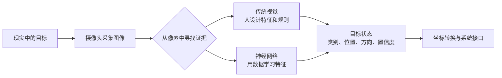

# 00：认识电赛视觉

## 这一关解决什么问题

摄像头不会直接给出“这是红色方块，它在画面左上角”。它只会持续产生图像“这是红色方块，它在画面左上角”是我们大脑思考判断的结果，我们学习的视觉解决两个问题：准确无误的定位到期望的目标、解析目标对应的题目逻辑。视觉程序要从像素中寻找证据，把图像逐步变成类别、位置、方向、边界框或置信度，再把结果交给坐标转换和其他系统。

这一关不要求记住一串算法名，也不要求安装视觉模块。先建立一张地图：视觉任务大致有哪些，传统视觉和神经网络分别怎样工作，一种算法在完整系统中处于什么位置。

## 先读这篇架构导读

[一张图像如何变成“物体”：从传统视觉到神经网络](01-一张图像如何变成物体.md)会回答下面几个问题：

- 识别、检测、定位和跟踪有什么区别；
- 为什么传统视觉里会出现颜色空间、滤波、阈值、形态学、轮廓和特征；
- HOG、LBP、SVM 和 KNN 位于哪一层；
- 神经网络改变了哪一步，CNN 为什么会出现在图像任务中；
- TensorFlow、Keras、PyTorch、YOLO、NPU 和开发板分别属于算法、模型、框架还是部署层；
- 面对一道电赛视觉任务，应该先尝试传统视觉还是神经网络。

读文章时不要问“哪个算法最强”，先问：“输入是什么，我要输出什么，哪一步还不能稳定完成？”

## 学习前需要会什么

会读基础 Python 代码即可。没有开发板也可以完成这一关。

## 这一阶段要建立的共同语言

- 像素：图像中一个位置保存的颜色或亮度数据。
- 图像帧：摄像头在某一时刻得到的一张图。
- 分辨率：一帧图像横向和纵向包含多少像素。
- 颜色空间：描述颜色的方式，例如 RGB、HSV、LAB 和灰度。
- ROI：只处理图像中的一块区域，缩小搜索范围。
- 特征：可以计算、比较并用于区分目标的信息，例如颜色、面积、轮廓、角点或纹理。
- 检测：在当前图像中回答“有什么、在哪里”。
- 跟踪：利用连续帧回答“下一帧里的目标是不是刚才那个”。
- 目标状态：视觉系统真正交付的数据，例如类别、中心坐标、边界框、角度和置信度。

## 跟着完成什么练习

任选一个明显物体，例如红色方块、黑色圆环或数字卡片，完成下面四步：

1. 写清输入条件：相机是否固定，背景和光照是否可控，目标是否会旋转或遮挡。
2. 写清最终输出：只要类别，还是还要中心坐标、角度或连续轨迹。
3. 分别画出一条传统视觉方案和一条神经网络方案，不需要写代码。
4. 说明你会先验证哪条方案，以及它最可能在哪种画面中失败。

传统视觉方案至少要写出“图像如何变成候选区域”；神经网络方案至少要写出“数据从哪里来、模型输出什么”。

## 做到什么算过关

你能够：

- 不背定义地解释检测和跟踪的区别；
- 画出“采集—感知—目标状态—系统接口”的完整数据流；
- 看到一个算法名时，判断它大致属于预处理、分割、特征、决策、跨帧跟踪还是模型部署；
- 根据任务条件说明为什么先选传统视觉、神经网络或两者组合。

## 这条学习路线为什么这样安排

本项目的入门顺序来自一条实际学习路径：先跟随 OpenMV 教程认识基础视觉任务，再转到 MaixCAM Pro 和 MaixPy 跑通板端程序；之后用 OpenCV 系统学习传统视觉处理链，最后进入 YOLO11 的数据、训练、量化和板端部署。OpenMV 是启蒙资料来源，不是必须购买的硬件。

## 下一阶段

进入 [MaixCAM Pro 与 MaixPy](../01-MaixCAM-Pro与MaixPy/README.md)，先用封装好的函数完成第一个实时视觉程序。
