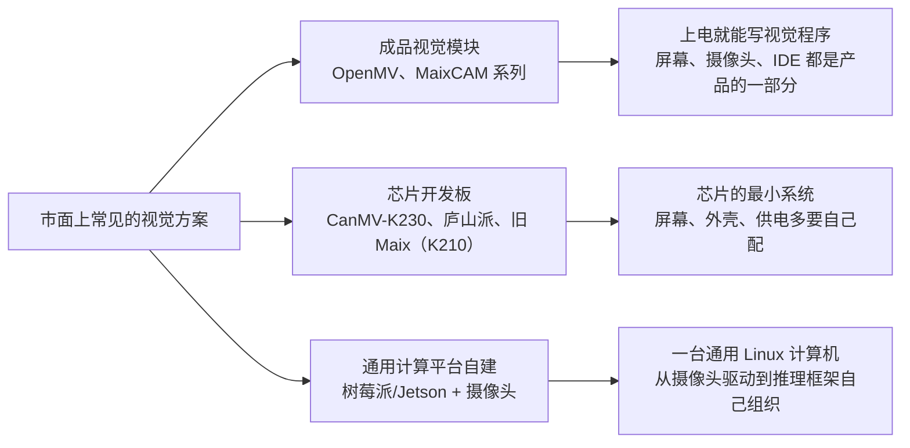

# 为什么选 MaixCAM：主流视觉设备对比

第一次准备电赛视觉，最先卡住你的往往不是算法，而是买什么设备。网上的推荐有着 OpenMV、各种 K230 开发板、MaixCAM，还有"树莓派+摄像头"的自己组装方案，价格从两三百到上千。这篇文件回答一个问题：这些名字之间真正的差别在哪里，以及为什么这条路线的第 1 关选 MaixCAM Pro。

读完以后你应该拿到一个判断方法：再看到任何视觉设备，先判断它属于哪种形态——成品视觉模块、芯片开发板，还是通用计算平台自己搭系统——而不是只比价格和"识别准不准"。形态决定了它的能力天花板，也决定了你开跑之前要自己搭多少东西。

## 先分清三种形态

三种形态都能找到色块、画出中心点，"能不能识别"不是它们的分界。分界在两件事：芯片形态决定了能跑什么规模的处理，产品完成度决定了入门前要搭多少环境。

## 芯片决定了天花板：单片机和 SoC 的差别

OpenMV 是这个圈子里历史最久、教程最全的成品模块，星瞳科技的中文教程也是我建立视觉概念的起点。但要看清它的定位，得看芯片：OpenMV 主力型号用 STM32H743（H7 Plus，Cortex-M7 单核 480MHz）、i.MX RT1062（600MHz）这一类**单片机（MCU）**，没有 NPU。传统视觉它们又快又稳——找色块、找直线、AprilTag 都是强项；但深度学习推理只能靠 CPU 软件计算，跑得动的是 FOMO 这类为单片机裁剪的极小模型，YOLO11 这个量级的单阶段检测模型上不去。2025 年发布的 OpenMV N6 补上了第一颗 NPU（0.6 TOPS@INT8）和全局快门摄像头，是目前 OpenMV 阵营算力最强的型号，但它仍是单片机：没有 Linux，也没有内置屏幕。

K210 是上一代"电赛神器"（Sipeed 早期 Maix 系列用的芯片）：双核 RISC-V @400MHz，KPU 标称 0.8 TOPS，8MB 片上 SRAM，没有 MMU，跑裸机 MicroPython，不能跑 Linux。它能跑很小的 CNN，内存和算力都撑不起现代检测模型。现在买设备不必再从它开始，但教程和开源工程里还会大量遇到它。

这一代的两颗主力芯片是 K230 和 SG2002，都是"双核 RISC-V + NPU + 跑 Linux"的架构：

|          | 嘉楠 K230                                   | 算能 SG2002                                                                                                     |
| -------- | ------------------------------------------- | --------------------------------------------------------------------------------------------------------------- |
| 常见载体 | 01Studio CanMV-K230、立创庐山派、嘉楠官方板 | Sipeed MaixCAM / MaixCAM Pro                                                                                    |
| CPU      | 双核 64 位 RISC-V C906，1.6GHz + 0.8GHz     | 1GHz C906 大核跑 Linux（另有一颗 1GHz Cortex-A53，与 C906 二选一启动）+ 700MHz C906 小核跑 RTOS + 8051 低功耗核 |
| NPU      | KPU，标称 6 TOPS 等效算力，INT8/INT16       | 1 TOPS@INT8，支持 BF16 模型                                                                                     |
| 内存     | 1–2GB LPDDR4                                | 256MB DDR3（集成在 MaixCAM 上）                                                                                 |
| 模型文件 | nncase 工具链转 `.kmodel`                   | `.cvimodel + .mud`                                                                                              |
| 产品形态 | 开发板：屏幕要外接，电池、外壳多为选配件    | 完整产品：触摸屏、摄像头、无线、电源管理、外壳出厂集成                                                          |

## 容易搞混的一点：MaixCAM 不是 K230

这两颗芯片同期出现，架构描述又像（双核 RISC-V、带 NPU、跑 Linux），所以网上经常把 MaixCAM 说成"K230 设备"。实际上不是：

- Sipeed 官方硬件页写明 MaixCAM 和 MaixCAM Pro 的主控是算能 SG2002。
- 本仓库第 3 关[部署 YOLO11](../03-YOLO11训练与部署/04-ONNX量化与部署.md)时，给 MaixCAM Pro 的是 `.mud + .cvimodel`——这是算能（CVITEK 系）工具链的模型格式；K230 生态用的是 nncase 转出的 `.kmodel`。两种模型文件互不通用。

这个区别不只是名字。它直接影响你查资料：拿着"K230 教程"往 MaixCAM 上套，会在模型转换这一步直接卡住；反过来，CanMV-K230 的例程也不能原样搬进 MaixPy。买之前分清，能省掉一整类"明明照着做却报错"的问题。

## 为什么说 MaixCAM 是"完整视觉产品里目前最强的"

先把"视觉完整产品"定义清楚：出厂就把处理器、摄像头、触摸屏、无线、电源管理和外壳集成成一台能独立工作的设备，并附带固件、IDE、文档和模型转换生态，上电就能开发。按这个定义逐个看：

- OpenMV 是这个类别里最成熟的对手，但主力型号（H7、RT1062）是无 NPU 的单片机，YOLO11 量级的模型上不了；最新的 N6 补了 NPU，算力仍低于 MaixCAM Pro 的 1 TOPS，而且没有 Linux 和内置屏。
- K230 的标称算力更高（6 TOPS 等效），但市面上是开发板形态：屏幕要另配，电池和外壳是选配件，生态围绕芯片厂 SDK 和 CanMV 展开。它是"高性能芯片的最小系统"，不是完整产品。
- 比 MaixCAM Pro 算力高的平台（树莓派加 AI 加速扩展、Jetson）全都要自己搭系统，已经不在"完整产品"这个类别里。

所以在"到手即用的完整视觉产品"这个类别里，MaixCAM Pro 的芯片平台、硬件完成度和 MaixPy/MaixVision/MaixHub 生态目前没有同级对手——这就是标题里"最强"的意思。两个边界要说清：第一，这不是说它的绝对算力天下第一，比它标称算力高的平台很多，只是都不在这个类别里；第二，各厂商的 TOPS 口径不一（等效算力、INT8、BF16 混着标），不要拿数字直接横比换算，同一颗芯片上的实测帧率才是有效证据。

另外别忽略普通版 MaixCAM：同一颗 SG2002，屏幕和无线配置低一些，预算紧时是合理取舍。这条路线统一以 Pro 为准，因为它的 640×480 触摸屏、WiFi6 和电池支持在现场调试时都用得上。

## 树莓派等芯片+摄像头是另一条路：系统架构

树莓派是一台通用 Linux 计算机，不是视觉产品。"树莓派+摄像头"方案的完整工作清单大致是：选摄像头模组并确认驱动（libcamera/V4L2 这一栈）、装系统和依赖（OpenCV、推理框架）、写视觉程序、处理开机自启、供电、体积、散热和 SD 卡寿命。每一步都不算难，但每一步都是"让一台通用计算机变成视觉设备"的**系统工程**——高算力芯片和摄像头驱动都由你自己组织，而不是产品替你做好。

这正是[三类学习目标](../README.md)里第三类——嵌入式应用方向——的领域：当你不再满足于现成产品，想自己搭系统、自己处理设备和系统问题时，才走这条路。它不是第 1 关的"更便宜替代"（算上屏幕、摄像头、存储卡和外壳并不便宜），也不是 MaixCAM 的"下一步升级"——它是另一门功课。本路线到第 5 关为止都在"用完整产品交付视觉结果"；嵌入式应用方向请在完整走完视觉侧之后再自行扩展，那时第 3～5 关沉淀的模型、坐标和接口约定仍然是你的联调基准。

顺带一提：树莓派本身没有 NPU，推理靠 CPU；官方 AI 扩展（Hailo）能显著提升推理算力，但那更是系统级方案。Jetson 算力强得多，同样属于"自己搭系统"，还叠加了价格和功耗。并且树莓派的优势体现在网上教程生态完善，其本身的价格配上他的的算力其实不值得被推荐，这里列出只为了方便理解不构成任何购买建议。

## 这条路线为什么从 MaixCAM Pro 开始

第 1 关的目标是用最短的路径建立"代码在设备上连续运行"的闭环。MaixCAM Pro 把闭环需要的所有环节都做成了产品的一部分：触摸屏直接看中间结果，MaixVision 管代码运行和传图，MaixPy 把取图、检测、显示封装成几行代码，MaixHub 能把训练好的 YOLO11 在线转成板端模型。你的精力可以全部花在视觉本身——阈值、ROI、帧率、坐标——而不是环境搭建。

对于为什么不购买使用 MaixCAM2 并不是 MaixCAM2 不好而是对于打电赛这个需求来说 MaixCAM pro 已经绰绰有余的完成任务。当前内存价格大涨不建议花费上千元购买完整的产品使用，当觉得 MaixCAM pro 的能力不再够用（更大的模型、多路摄像头、自定义系统）时，你自然就带着完整的视觉侧交付能力进入了嵌入式应用方向开始自己搭建设备，而不是购买使用完整的产品。

## 自检

1. OpenMV H7 Plus 跑不动 YOLO11 量级模型，缺的是芯片层的什么？
2. MaixCAM 和 CanMV-K230 都自称"双核 RISC-V + NPU"，它们的模型文件能互相用吗？为什么？
3. "树莓派+摄像头"方案的工作量主要花在哪里？它对应三类学习目标中的哪一类？
4. 队友说"买 K230 开发板吧，标称 6 TOPS 比 MaixCAM 强"。你会怎么回应？

## 参考与核验

- [Sipeed MaixCAM 硬件页](https://wiki.sipeed.com/hardware/zh/maixcam/maixcam.html)
- [Sipeed MaixCAM Pro 硬件页](https://wiki.sipeed.com/hardware/zh/maixcam/maixcam_pro.html)
- [OpenMV 官网（H7 Plus、N6）](https://openmv.io)
- [01Studio CanMV-K230 官方 Wiki](https://wiki.01studio.cc)
- [树莓派官网](https://www.raspberrypi.com)

外部链接最后核验于 2026-09-20。
