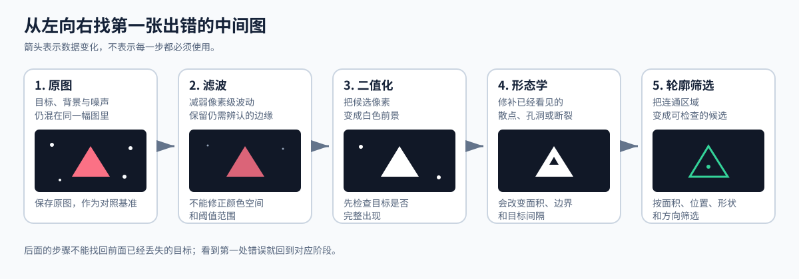
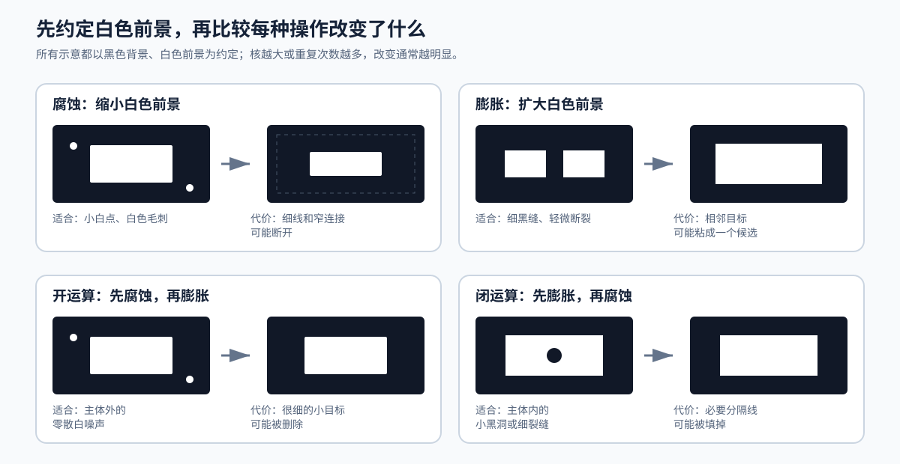
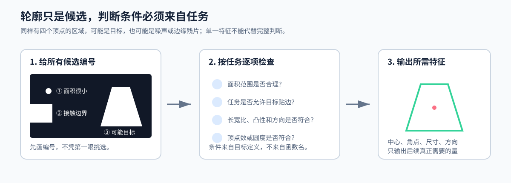

# 01：滤波、形态学与轮廓——把原始图像变成可靠候选

这篇先用 OpenCV 建立传统视觉的处理思路。读完后，你应该明白：滤波、形态学和轮廓不是必须依次叠加的“固定套餐”，而是分别处理像素波动、二值区域缺陷和候选几何判断；每一步是否保留，要由中间图决定。这里推荐一个速成的视频资源[OpenCV 三子棋棋盘/棋子识别，越简单越好](https://www.bilibili.com/video/BV1p6jAz6EkH/?share_source=copy_web&vd_source=682bdd70c850416db8211ef20a4dba80)方便大家理解，避免因为阅读文本感觉枯燥。

先在电脑上学习这些操作，是因为 OpenCV 便于保存和并排比较每个阶段。理解机制以后，再进入[MaixPy 图像处理接口](02-MaixPy图像处理接口.md)，把同样的判断落实到 MaixCAM Pro 的封装函数中。



## 先建立一条可观察的处理链

传统视觉通常沿着下面的数据流工作：

```text
原图 → 颜色或灰度表达 → 滤波 → 阈值分割 → 形态学 → 轮廓 → 几何筛选
```

箭头表示数据怎样变化，不表示每一步都必须使用。原图已经能稳定分割时，可以不滤波；二值图已经干净时，可以不做形态学。调试时先保存原图，再保存每个中间结果，从左到右找第一张出错的图。

本篇约定“目标是白色前景，背景是黑色”。后文所说的腐蚀、膨胀、孔洞和轮廓都以这个约定为准。若阈值结果相反，先反转掩膜，或把下面的直观描述反过来理解。

## 滤波解决什么问题

摄像头图像中可能有传感器噪声、压缩纹理和局部亮暗波动。它们会让本应相近的像素跨过阈值，最后在二值图中形成散点或毛刺。滤波在阈值分割前调整邻域像素，目标是减少这类波动。

滤波也会损失信息。核越大，变化范围越大，目标边缘、细线和小缺口越容易被抹掉。因此不要先问“哪个滤波最好”，要先观察噪声长什么样，再比较滤波前后的目标边界和二值结果。

下面四种结果要分别保存，不要串成一条流水线：

```python
import cv2

gray = cv2.imread("input.png", cv2.IMREAD_GRAYSCALE)
if gray is None:
    raise FileNotFoundError("input.png")

# Keep every result independent so that the effects can be compared.
mean = cv2.blur(gray, (3, 3))
gaussian = cv2.GaussianBlur(gray, (3, 3), 0)
median = cv2.medianBlur(gray, 3)
bilateral = cv2.bilateralFilter(gray, 5, 30, 30)
```

### 均值滤波：先认识“邻域平均”的代价

`cv2.blur()` 用核覆盖区域的平均值替换中心像素。它直观、参数少，适合用作比较基线；噪声会被摊平，边缘也会一起变软。若均值滤波后的二值边界明显偏移，就不应为了去噪继续加大核。

### 高斯滤波：让近处像素拥有更高权重

`cv2.GaussianBlur()` 同样做邻域加权，但中心附近的像素权重更高。它常用于减弱连续、细碎的亮暗波动。核的宽和高必须为正奇数；从 3×3 开始观察即可，不能把“大核更干净”理解为“大核更准确”。

### 中值滤波：针对孤立亮点和暗点

`cv2.medianBlur()` 用邻域中值替换中心像素，对椒盐噪声这类孤立极亮点、极暗点更有针对性。它可能把尺寸接近核的小目标也当作异常点，因此要同时观察噪点是否消失、目标细节是否还在。

### 双边滤波：需要保边时再尝试

`cv2.bilateralFilter()` 同时考虑像素位置和像素值的接近程度，可以在平滑区域时减少跨边界混合。它的参数更多、计算量也更大，不是默认步骤。只有普通平滑确实破坏了关键边缘时，再固定其他条件比较它是否值得保留。

### 滤波不能替你修正阈值

颜色空间选错、曝光过亮或过暗、目标与背景本来就重叠，都不是换一个滤波器能解决的问题。若滤波前后差别很小，二值图仍然漏掉目标，应回到采图、颜色空间和阈值范围，而不是继续叠加滤波。

## 为什么滤波之后要先看二值图

阈值分割把“可能属于目标”的像素变成白色，其余像素变成黑色。它只产生候选，不代表识别已经完成。下面以高斯滤波结果为例生成一张掩膜：

```python
# Otsu is only an example for a grayscale image with separable foreground and background.
_, mask = cv2.threshold(
    gaussian,
    0,
    255,
    cv2.THRESH_BINARY + cv2.THRESH_OTSU,
)
```

Otsu、固定阈值和自适应阈值各有适用条件。这里先不把算法选择展开成另一篇教程，只检查三件事：

1. 目标是否完整变白；没有变白的部分无法由后面的形态学凭空恢复。
2. 错误属于哪种形态：主体外白点、主体内黑洞、边缘断裂，还是相邻目标粘连。
3. 必须保留的细线、间隔和尖角有多大；结构元素不能比这些关键细节还粗。

例如同一个亮点落在白纸和黑色胶带上时，背景亮度不同，未必能共用一组范围。应先让阈值产生合理候选，再讨论怎样修补候选。

## 结构元素决定形态学怎样改变前景

形态学用结构元素（也叫核）检查像素邻域。核的形状、尺寸和重复次数共同决定改变的方向与范围：矩形会同时覆盖横向和纵向邻域，椭圆更适合不希望引入方角的目标，十字形只在水平和竖直方向包含邻域像素。

先用 3×3 矩形核做一次操作，目的是让变化容易观察，不是把它当作通用答案：

```python
kernel = cv2.getStructuringElement(cv2.MORPH_RECT, (3, 3))

eroded = cv2.erode(mask, kernel, iterations=1)
dilated = cv2.dilate(mask, kernel, iterations=1)
opened = cv2.morphologyEx(mask, cv2.MORPH_OPEN, kernel, iterations=1)
closed = cv2.morphologyEx(mask, cv2.MORPH_CLOSE, kernel, iterations=1)
```

不要同时改变核形状、核尺寸和 `iterations`。一次只改一个量，才能知道是哪项修改造成了目标消失或粘连。



### 腐蚀：缩小白色前景

腐蚀让白色边缘向内收缩，可以去除小白点、削掉毛刺，也可以断开很窄的白色连接。代价是目标面积减小，细线和小目标可能直接消失。若关键结构被腐蚀掉，应撤回或减弱腐蚀，而不是假设后续膨胀一定能原样恢复。

### 膨胀：扩大白色前景

膨胀让白色边缘向外扩张，可以连接轻微断裂或跨过很窄的黑缝。代价是相邻目标可能粘成一个连通区域。发生粘连后，轮廓阶段通常只能看到一个候选，因此不能指望仅靠面积阈值重新拆开它们。

### 开运算：先腐蚀，再膨胀

开运算适合“主体完整，周围有小白点”的二值图。较小白点在腐蚀阶段消失，较大主体再被膨胀。主体本身很细、很小或依赖窄连接时，开运算同样可能删除有效信息。

### 闭运算：先膨胀，再腐蚀

闭运算适合“白色主体内部有小黑洞或细裂缝”的二值图。膨胀先跨过缺口，腐蚀再收回外边界。若两个目标之间的黑色间隔本来必须保留，闭运算也可能错误地填掉它。

## 轮廓把白色区域变成候选

轮廓是一组沿边界排列的点，不等于“已经识别出目标”。当前 OpenCV 4.x 的 Python 接口返回轮廓列表和层级关系：

```python
contours, hierarchy = cv2.findContours(
    mask,
    cv2.RETR_EXTERNAL,
    cv2.CHAIN_APPROX_SIMPLE,
)
```

`RETR_EXTERNAL` 只返回最外层轮廓，适合只关心独立物体外形的起步练习。若孔洞、嵌套边框本身有意义，再使用 `RETR_TREE` 研究层级。`CHAIN_APPROX_SIMPLE` 会压缩直线段上的冗余点，但不会自动把任意轮廓变成规则图形。



对每个候选，应根据任务逐项提取特征，而不是只看一个函数返回值：

1. 用 `cv2.contourArea()` 排除尺寸明显不符的区域，同时保留原图确认小目标没有被误删。
2. 用 `cv2.boundingRect()` 查看水平外接框；目标允许旋转时，再用 `cv2.minAreaRect()` 观察方向与旋转外接框。
3. 用 `cv2.arcLength()` 计算周长，再把与周长相关的误差传给 `cv2.approxPolyDP()`。误差越大，近似点通常越少，必须在多张图上验证。
4. 识别矩形时同时检查面积、长宽比、凸性和顶点数；识别圆形时可以再比较面积与周长。单独满足“四个顶点”不能证明候选就是目标。

贴边候选是否删除、面积范围多大、允许什么方向，都来自具体任务。不要把一次实验的阈值写成所有图片都适用的规则。

## 用同一组图片完成最小实验

准备同一目标的三张图：一张正常图、一张带孤立亮暗点的图、一张带孔洞或断裂的图。每张都保存原图、滤波图、二值图、形态学结果和带编号的轮廓图。

1. 正常图先不加形态学，确认阈值和轮廓筛选可以成立。
2. 噪点图分别比较均值、高斯和中值滤波，不串联它们；记录噪点与目标边缘各发生了什么变化。
3. 在二值图上分别运行腐蚀、膨胀、开运算和闭运算；每次都从同一张 `mask` 开始。
4. 只保留能修复已观察问题、且没有破坏关键结构的步骤。
5. 更换光照或背景后重跑，找到最早失效的中间图。

可直接使用仓库中的[特征处理链示例](../../配套资源/示例代码/opencv/README.md)保存各阶段，也可以用[离线视觉流程调试器](../../配套资源/工具/视觉流程调试器/README.md)并排观察结果。

## 学到什么程度算完成

完成本篇后，你应能面对一张失败图片指出最早出错的阶段；根据噪点、孔洞、断裂或粘连选择一个有理由的操作；说明核大小会损失哪些细节；并解释最终候选为何通过面积、位置和几何条件。

下一篇不再重复这些机制，而是讲[同一组操作在 MaixPy 中怎样调用](02-MaixPy图像处理接口.md)，以及为什么在 MaixCAM 上应先尝试 `maix.image` 的封装接口。

## 资料与版本说明

- 仓库内的 [OpenCV-Python 中文教程](OpenCV-Python-Tutorial-中文版.pdf)第 16、17、21 章用于理解滤波、形态学和轮廓的基本机制。该资料面向早期 OpenCV 3.0，代码返回值不能不加核对地照搬。
- 当前函数写法以 OpenCV 4.x 官方教程为准：[图像平滑](https://docs.opencv.org/4.x/d4/d13/tutorial_py_filtering.html)、[形态学变换](https://docs.opencv.org/4.x/d9/d61/tutorial_py_morphological_ops.html)、[轮廓入门](https://docs.opencv.org/4.x/d4/d73/tutorial_py_contours_begin.html)和[轮廓特征](https://docs.opencv.org/4.x/dd/d49/tutorial_py_contour_features.html)。
