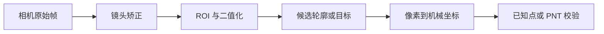

# 相机畸变矫正：先确认误差，再固定到整条管线

读完本篇，应该能回答一件事：为什么“中心已经准了，边缘却越来越偏”不能靠修改比例尺掩盖，以及怎样把镜头矫正作为一项**赛前预置、现场可验证**的配置，而不是临时改代码的赌注。

在毫米级定位中，画面看起来有一点弯并不自动说明要开畸变矫正。真正有用的是已知点的误差分布：中心附近基本正确，越到边缘，偏差越明显地沿着指向或背离画面中心的方向变化。此时单独改 `px_per_mm` 或中心偏移，往往只能让某一小片区域重新对上。

2026 拼图的视觉管线在取图后、检测前调用 `lens_corr`，矫正强度从配置读取；现场的 Light 页面可以显示并调整这一强度。对应实现可查看[主程序](../../配套资源/历年题目参考代码/2026-拼图视觉/main.py)、[配置](../../配套资源/历年题目参考代码/2026-拼图视觉/config.json)和[视觉管线](../../配套资源/历年题目参考代码/2026-拼图视觉/vision.py)。这里的数值是那套镜头、分辨率和安装方式下的记录，不是可直接抄用的通用参数。

## 先分清：它修的是镜头误差，不是所有坐标误差

镜头畸变会让同一物理距离在画面不同位置对应不同的像素关系。常见的径向畸变会让直线在画面边缘更弯；切向畸变则与镜头和成像平面的不完全平行有关。OpenCV 的[相机标定文档](https://docs.opencv.org/4.13.0/dc/dbb/tutorial_py_calibration.html)给出了这两类畸变、标定系数和去畸变的定义。

但“坐标不准”还有别的原因。先用同一批已知点观察误差，再决定去哪个页面调整：

- 所有点几乎朝同一方向平移，先检查机械原点或 `robot_offset`。
- 误差随离中心的距离整体增大、方向基本一致，先检查 `px_per_mm`。
- 左右或上下呈镜像关系，先检查轴交换和方向符号。
- 中心点较准，边缘点呈放射状渐偏，才把镜头畸变列为主要嫌疑。
- 只有局部区域异常，或误差随工作平面高度变化，镜头矫正也许不是答案；还要检查相机姿态、平面倾斜和遮挡。

这种区分决定了现场操作是否有意义。把畸变当成比例问题去调，可能让中央点更准，却让边缘更差；反过来，用畸变强度补偿整体偏移也不会让坐标系正确。

## 两种矫正方式，适用的准备阶段不同

### 方式一：在设备端对每帧图像做强度式矫正

这是本仓库 2026 拼图代码实际使用的方式。程序从相机读取图像后，在 `strength > 0` 时执行 `img.lens_corr(strength=...)`，再把返回图像交给 ROI、二值化、轮廓和坐标计算。现场 GUI 的 `L-`、`L+` 改的是这个预先暴露出来的参数，并保存到配置。

它的优点是适合已经部署在板端的项目：赛前把“当前强度、增减步长、保存行为、五点校验”全部写好后，现场不需要打开代码或重新烧录。它的限制也很明确：`strength` 只是这条接口可调的一个强度参数，不能证明它适合所有镜头、分辨率或安装高度。

### 方式二：赛前求相机内参和畸变系数，再用映射去矫正

如果镜头畸变更明显，或需要说明每个校正参数从何而来，可以在赛前拍摄多张棋盘格或圆点阵图片，求出相机内参和畸变系数。OpenCV 的 `calibrateCamera()` 可以由多组已知图案点求得这些参数，之后每帧使用 `undistort()` 或预先计算的 `remap()` 映射去矫正。[官方教程](https://docs.opencv.org/4.13.0/dc/dbb/tutorial_py_calibration.html)还说明了新画面边缘可能出现无效区域，需决定保留还是裁剪。

教学脚本 [coordinate_validator.py](../../配套资源/示例代码/通信与gcode/coordinate_validator.py) 把同一思想压缩成只含 `k1/k2` 的简化径向模型，在坐标映射前对检测像素做"点级"矫正，用来单独理解这一步骤的公式；它不依赖 OpenCV，也不等于完整内参标定。

这是一种赛前工程准备方式，不是把棋盘格带到现场才开始补救。本仓库的 2026 归档没有采用这套“系数文件 + 映射表”流程，因此不能把它写成已经在该项目验收过的方案。若你采用它，GUI 至少应能显示当前使用的是哪份参数文件、矫正后有效 ROI，以及本次标定是否已重新验证。

## 矫正必须在检测和标定之前

无论选哪种方式，几何关系只能有一套。推荐把数据流固定为：

也就是说，矫正后的图像要同时用于 ROI、特征提取、像素到毫米映射和已知点验证。以下做法会让坐标没有共同依据：

- 在原图上标定，却在矫正图上检测；
- 只让屏幕显示经过矫正，实际检测仍使用原图；
- 更改矫正强度后，继续沿用旧的比例、偏移和误差记录；
- 图像尺寸或裁剪已经改变，却继续使用另一分辨率下的矫正配置。

镜头矫正改变了像素位置。因此，开关矫正、修改强度、更换分辨率、改变 ROI 原点、相机姿态或工作平面高度后，都应重新执行[坐标标定](01-坐标标定.md)，而不是只改公式中的一个常数。

## 现场怎样调：一次只验证一个假设

比赛现场不能依赖改代码来处理新光照、新摆放或边缘误差。能调什么、怎样保存、改完如何证明，必须在赛前就通过 GUI 和配置文件固定下来。以 2026 项目的 Light、Calibrate、Offset 页面为例，畸变矫正可按下面的顺序进行：

1. 固定相机、工件平面、分辨率和 ROI，先完成一次基准标定；不要同时移动相机和调镜头参数。
2. 在中心、左右、上下等已知位置做 PNT 或等价的多点测试，记录每个点偏离十字的位置和方向。
3. 只有出现“中心准、边缘放射状渐偏”时，才在 Light 页面把矫正强度微调一个预设步长；不要同时改曝光、阈值、`px_per_mm` 和偏移。
4. 用**同一批点**重新做多点测试。比较中心和边缘是否共同改善，而不是只看边缘直线“看着更直”。
5. 确定矫正配置后，重新执行比例尺和偏移标定，再做一次全场校验；GUI 应明确显示当前强度及已保存状态。

2026 说明书中的五点校验覆盖中心、左中、右中、上中、下中。它不能替代密集的精度测试，却足以在现场把“整体偏移、轴向镜像、比例不符、边缘放射状误差”分开，避免盲调。

## 为畸变准备的 GUI，至少要留下这些证据

GUI 不是为了给一个参数加减按钮，而是为了让下一次点击有可追溯的依据。自己的项目至少要预置：

- 当前图像分辨率、ROI 和镜头矫正开关/参数；这些是坐标标定的前提。
- 矫正后的实时画面，以及 ROI、候选轮廓、图像中心和最终坐标叠加；这样能看出误差首次在哪一层出现。
- 预置的参数步长和明确的保存提示；现场只能改变设计时允许改变的值。
- 多点校验入口，以及每个点的预期位置、实际偏差或至少通过/失败状态。
- 当前配置的来源或版本标识；重启后能确认程序仍在使用刚刚验证过的参数。

其中“保存”不等于“已经正确”。真正的完成条件是：同一条矫正后的管线产生检测结果、坐标结果和多点校验；中心与边缘的误差都达到任务要求。把这套证据留在 GUI 中，现场才不需要靠记忆或临时改代码猜测哪一项参数生效了。

下一篇[GUI 调试界面](03-GUI调试界面.md)会把这些参数页、观察页和校验页组合成一条现场调试流程。
