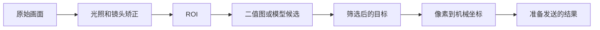

# GUI 调试界面：把赛场上不能改的代码，变成可验证的预置流程

比赛现场出现问题时，真正稀缺的不是一个“识别成功”的提示，而是判断下一步该做什么的证据。现场不能把重新改代码、重新部署和重新试错当作常规手段；赛前没有写进 GUI 的观察、调参和标定入口，现场通常就没有安全、可复现的修改方式。

因此，GUI 不是演示画面的装饰。它是把赛前已经想清楚的几类现场决策固化下来：看哪一层结果、允许改哪个参数、一次改多少、何时保存、改完用什么校验、什么情况下禁止进入正式运行。读完本篇，应该能按这个思路设计自己的调试界面，而不是只在屏幕上叠一个最终框。

2025 和 2026 的归档代码都把按钮和状态直接绘制在相机画面上。2026 代码使用 `menu / debug / calibrate / calib_offset / light / running` 等状态，将观察、标定和正式运行分开；触摸坐标通过 `resize_map_pos_reverse()` 映射回图像坐标，再进行按钮命中判断。可从[主程序](../../配套资源/历年题目参考代码/2026-拼图视觉/main.py)、[GUI 工具](../../配套资源/历年题目参考代码/2026-拼图视觉/ui.py)和[2025 的 `MyUI.py`](../../配套资源/历年题目参考代码/2025-TI杯视觉/MyUI.py)核对这一实现。

## 为什么只显示最终结果不够

一个最终框、一个类别或一组坐标，只能告诉你程序的最后结论，不能告诉你它在哪一步开始错。调试页面应让每层都有能观察的输出：

对每一层，GUI 要回答不同的问题：

- 原始画面和相机状态：目标是否真的在画面中，是否太暗、过曝、失焦或被遮挡？
- ROI：程序是不是在正确的工作区域找目标？如果 ROI 都错了，继续调阈值没有意义。
- 二值图、候选框或候选轮廓：目标有没有在筛选前被保留下来？背景有没有被误认为目标？
- 最终目标：筛选条件删掉了谁，类别、中心、角度和置信度是否符合预期？
- 坐标与运行状态：真正用于后续动作的是哪一组坐标，当前是调试、标定还是正式运行，帧率和耗时是否还能接受？

例如，2026 的 Debug 页会叠加 ROI、轮廓、质心和画面中心；还可切换查看整屏二值图。候选轮廓存在而最终目标消失，应先检查筛选或匹配条件；二值图里目标已经碎掉或背景一片白，才回到光照、极性和阈值。这个顺序能避免“看见结果不对就一起乱调”。

## 把现场需要的动作预先拆成页面

下面的页面划分来自 2026 拼图归档和它的操作说明。它不是所有项目唯一的菜单结构，但每一页都对应一类不同的现场问题，适合作为设计检查表。

### 1. 主菜单：先区分进入哪条流程

主菜单把 Start、Debug、Calibrate、Light、Home、TEST 和退出分开。Start 不承担调参职责；Debug 不承担正式运行职责。这样，面对问题时先选择诊断路径，而不是让一个按钮同时“识别、发送、机械动作”。

对于会影响坐标或安全状态的项目，Home 或等价的基准确认应是后续标定与运行的前提。本文不展开下位机控制细节，但 GUI 至少要把“尚未回到已知基准状态”显示出来，而不是默默允许用户继续。

### 2. Light：先让输入画面可用

现场光照和背景可能与赛前不同。2026 的 Light 页预置了曝光、增益、CLAHE 和镜头矫正强度的调整入口，并可恢复自动曝光。它的价值不在于给出一组万能数值，而在于把本来只能通过改代码访问的相机和预处理参数提前暴露出来。

调光时要看的是实时画面和 Debug 页的中间结果：目标轮廓是否清楚、二值图中的前景是否完整、背景是否被误检。不要只因最终结果少了一个目标就连续提高增益；那样可能把噪声一并放大。镜头矫正的调整与复验见[相机畸变矫正](02-相机畸变矫正.md)。

### 3. Debug：观察程序眼中的世界

2026 的 Debug 页把二值化模式、反色、CLAHE、纸张极性、阈值增减和保存做成独立控件，并在顶部显示当前模式和阈值信息。这里最值得借鉴的不是某种算法名称，而是三个设计点：

- 原图与二值图都能看，不能只留最终框。
- 每次点击只改变一个明确参数，例如反色或固定阈值的一个预设步长。
- 保存经过二次确认，防止一次误触把尚未验证的值写进配置。

如果项目用模型而不是二值化，同样的思路仍成立：替换为原始画面、预处理后输入、模型候选框、置信度过滤后结果和最终坐标，不必照搬二值化按钮。

### 4. Calibrate：把比例和视觉特征写入可检查的配置

2026 的 Calibrate 页会显示 30 mm 方块的像素边长、换算得到的 `px_per_mm`、检测到的对象数量和模板结果；当自动识别不可靠时，页面还提供很小步长的人工微调，并显示手动状态。代码还会拒绝与现有比例差异过大的结果，避免误检把可信参数覆盖掉。

这说明标定 GUI 不应只有一个“保存”按钮。至少要让操作者看到：标定物有没有被识别、计算依据是什么、得到的新值是多少、保存是否成功，以及本次结果是否应被拒绝。否则“可调”只是在把风险从代码迁移到屏幕。

### 5. Offset 与多点校验：证明整幅画面能对上

Offset 页把图像参考点对应的机械偏移、轴方向和多点校验放在同一条流程里。2026 的 PNT 会依次在中心、左中、右中、上中、下中画十字，并让系统移动到对应位置，以便观察全场是否对齐。

多点校验的意义是把不同症状分开：整体同向偏移时看 offset；上下或左右镜像时看轴方向；中心准而边缘放射状渐偏时回到镜头矫正；整体逐渐变大或变小时再检查比例尺。没有这一页，现场很容易把所有问题都归结为“再改一点比例”。

涉及可能造成实际动作的测试，界面应明确显示当前值、测试目标和确认状态；不要让调参的点击隐式触发正式运行。这样既不把控制逻辑塞进教程，也能让视觉侧的参数修改有明确边界。

### 6. TEST 与运行页：运行前确认状态，运行中解释结果

TEST 用于在进入流程前检查已经预置的提示和显示是否可用。运行页则持续显示当前阶段、进度、累计耗时、候选目标与目标位置的关系。2026 的运行叠加层用不同颜色画出目标区域、当前目标和连接关系，操作者可以区分“没检测到”“识别到了但目标坐标不对”和“已经进入下一阶段”。

运行页不是让人临时调算法的地方。赛前应规定哪些状态只读、哪些页面允许修改，并让 GUI 明确回报当前模式，避免在正式动作过程中误触调试控件。

## 一条可执行的现场调试顺序

把页面写出来还不够，顺序也要预先确定。2026 说明书把操作固化为 `Home → Light → Debug → Calibrate → Offset → TEST → Start`。迁移到自己的项目时，可以保留这一推理链：

1. 确认相机、显示和坐标基准处于已知状态。
2. 若现场光照或背景变化，先在 Light 页让输入画面和前景对比可用。
3. 到 Debug 页确认 ROI、候选和中间图；问题最早出现在哪一层，就回到对应参数页。
4. 输入和候选稳定后，再标定比例、偏移和方向；不要先调坐标来掩盖识别失败。
5. 用多个已知点验证整幅画面，特别检查中心与边缘。
6. 确认保存状态和运行前自检后，才进入 Start。

这条顺序的重点不是让每次都完整点击所有页面，而是当现场条件变化时有一条不依赖重新写代码的排查路径。若 PNT、二值图或候选结果没有通过，就回到前一层继续验证，不带着未知参数进入正式流程。

## 自己实现时，GUI 必须满足的边界

一个够用的 GUI 不需要做成复杂桌面软件，但应满足以下约束：

- **可观察**：保留原始帧、关键中间结果、最终结果和当前配置；每一层发生问题时都有画面或数值可看。
- **可控但有限**：只给现场确实允许调整的参数设置按钮、步长和取值范围。没有预置的能力，现场就不应假装能安全调出结果。
- **可验证**：每个参数页都有对应的检查方式，例如二值图、已知尺寸、五点校验或保存反馈。
- **可追溯**：界面显示当前模式、关键值和保存状态；重启后仍能确认使用的是哪套配置。
- **不混合职责**：识别、参数修改、保存、标定校验和正式动作由不同操作触发。可能造成实际动作的按钮需要明确的前提和确认。
- **坐标一致**：画面以等比缩放显示时，触摸坐标必须反向映射回图像坐标。否则按钮画在图上，实际点击区域会随屏幕比例漂移。

最后的完成条件不是“界面看起来像产品”，而是现场拿到一帧异常图像时，操作者能在不改代码的前提下回答：输入是否正确、目标在哪一步消失、当前坐标依据是什么、能安全调整什么、调整后怎样证明有效。这样的 GUI 才是标定和比赛流程的一部分。
