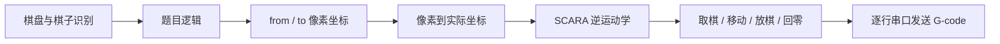

# 2024 三子棋：G-code 输出版

> 这是 2024 年往年题目的参考代码。它记录的是“视觉端继续生成 G-code，控制器负责解释并执行命令”的实现，不是本人 2024 年的参赛项目。

这一版与坐标版共享棋盘识别、棋子映射、题目逻辑和 `from/to` 生成思路，但没有在点对产生后立即结束。视觉端还会把像素坐标映射到实际工作范围，按 SCARA 大臂、小臂参数做逆运动学计算，再生成拿棋、移动、放棋和回零命令。

当前 [my_utils.py](my_utils.py#L19) 创建生成器时设置了 `angle_mode=True`，因此这里采用的是 SCARA 关节角模式。原简述中的 `scr` 应理解为 SCARA 机械结构。

## 一次动作怎样从图像变成 G-code



### 1. 主流程仍先产生 `from` 和 `to`

[main.py](main.py) 负责相机、棋盘、棋子、任务队列和题目分发。[topic_request.py](topic_request.py) 把简单放置或对弈结果统一转换成：

```python
{
    "from": (x1, y1),
    "to": (x2, y2),
}
```

这一步与坐标版的接口相同，所以两版可以从 `sending_coordinate_data()` 开始比较。差别是：坐标版在这里编码 JSON，G-code 版继续生成动作。

### 2. 发送层保存了机械标定参数

[my_utils.py](my_utils.py#L13) 初始化串口和 `GCodeGenerator`。当前归档参数包括：

- 串口设备 `/dev/ttyS0`，波特率 115200；
- 像素范围 `0..320 × 0..224`；
- 实际 X 范围 `0..270`，Y 范围 `0..185`；
- SCARA 两段连杆长度均为 `180.0`；
- 机械偏移 `offset_x=150.0`、`offset_y=150.0`；
- 起始、抬起和下落高度分别由 `Z_start`、`z_up`、`z_down` 保存；
- `angle_mode=True`，实际移动前需要计算两个关节角。

这些值是这套历史机构的现场参数，不是算法默认真值。相机视野、机械尺寸或原点改变后，应重新标定，而不是只修改 README 中的数字。

### 3. 像素坐标先线性映射到实际范围

[gcode_generator.py](gcode_generator.py#L105) 的 `pixel_to_real()` 分别对 U/X 和 V/Y 做线性映射：像素范围中的相对位置，被换算到给定的实际 X、Y 范围。

这种换算成立的前提是工作平面固定、相机姿态和裁剪范围不变，并且现场允许使用这组线性关系。它没有自动解决镜头畸变、透视变化或机械装配误差。

### 4. 实际坐标再转换为 SCARA 关节角

[gcode_generator.py](gcode_generator.py#L129) 的 `scara_inverse_kinematics()` 使用连杆长度和偏移计算 `theta`、`psi`。当 `angle_mode=True` 时，[move_to()](gcode_generator.py#L185) 输出的 `G1 X... Y...` 中，X、Y 表示这套控制器约定的两个关节角，而不是普通直角坐标平台上的毫米位置。

这也是本版本与“直接把世界坐标交给控制端”之间最重要的边界差异：视觉程序已经知道机械臂结构，并承担了逆解参数正确性的责任。

### 5. `from → to` 被展开为一组动作

[my_utils.py](my_utils.py#L39) 的 `sending_coordinate_data()` 按以下顺序组织一次移动：

1. 对 `from`、`to` 应用坐标修正；
2. 清空并开始本次 G-code；
3. 移动到 `from`；
4. 下移并打开执行器以拿取棋子；
5. 抬起后移动到 `to`；
6. 关闭执行器以放下棋子；
7. 抬到结束高度，执行 XY 回零并重设约定原点；
8. 逐行写入串口，然后清空生成器缓冲区。

[sendone.py](sendone.py#L46) 保留了一次实际调试输出，可以看到像素点、映射后的实际坐标、逆解角度和最终命令序列怎样对应。它是单条命令与串口回显测试，不是主程序入口。

## 代码中出现的命令

- `G28`：执行控制器定义的回零流程。
- `G90`：采用绝对坐标模式。
- `G1`：按设定进给参数移动；本工程的角度模式把 X、Y 字段用于两个关节角。
- `M400`：等待前面的运动完成。
- `G92`：把当前位置设置成指定的坐标值。
- `G4 P500`：暂停一段时间，给拿取或放置动作留出时间。
- `M150 U255` / `M150 U0`：本工程用于切换拿取执行器状态，是控制器专用约定，不应当作通用 G-code 语义。

这些命令只有在控制器固件采用相同解释时才成立。尤其是角度模式和 `M150`，需要与控制端实现逐项核对。

## 文件怎样阅读

- [main.py](main.py)：视觉主循环、串口回调、任务队列和题目分发。
- [look_for_data.py](look_for_data.py)：九宫格检测、排序，以及棋子到逻辑棋盘的映射。
- [topic_request.py](topic_request.py)：把小题规则和博弈结果统一转换为 `from/to`。
- [my_game.py](my_game.py)：棋盘状态、AI 落子、胜负与错误检查。
- [my_utils.py](my_utils.py)：把一次点对移动组织为 G-code 并逐行发送。
- [gcode_generator.py](gcode_generator.py)：像素映射、SCARA 逆解和具体命令生成。
- [constants.py](constants.py)：误差、模型路径、映射距离和棋子放置区边界。
- [BlackAndWhiteChess.mud](BlackAndWhiteChess.mud)：模型描述文件；模型实际加载路径由代码中的 `/root/models/BlackAndWhiteChess` 约定。
- [nn.py](nn.py)：单独检查模型加载和检测结果的脚本，不是主程序入口。
- [sendone.py](sendone.py)：单条 G-code 发送、串口回显和一次完整输出记录。
- [app.yaml](app.yaml)：MaixPy 应用清单。
- `dist/maix-hqybs-v0.0.1.zip`：当时保留的应用打包产物。

建议阅读顺序是 `main.py → topic_request.py → my_utils.py → gcode_generator.py`。前两步回答“移动哪颗棋”，后两步回答“视觉端怎样把这次移动翻译成机械命令”。

## 运行前需要核对

- 使用与代码时期匹配的 MaixCAM / MaixPy、模型和控制器固件。
- 不连接执行器，先打印整段 G-code，核对 `from/to`、实际坐标和逆解角度。
- 检查像素范围是否与相机和模型输入一致，不能在改变分辨率后继续使用旧范围。
- 实测 SCARA 连杆长度、安装偏移、关节正方向、可达范围和奇异位置。
- 核对 Z 高度、回零方向、限位开关和 `G92` 原点定义。
- 单独确认 `M150`、`M400` 等命令在当前固件中的含义。
- 先以低速、无负载方式验证边界点和中心点，再允许真实拿放动作。

本目录保存的是历史完整实现和现场参数。本次只完善说明，没有在当前 MaixCAM、控制器与 SCARA 机构上重新联调。

如果控制端已经负责坐标换算、运动学和轨迹执行，应改读同级目录中的[坐标输出版](../笛卡尔坐标系移动控制/README.md)。

返回：[2024 三子棋两版说明](../README.md)
