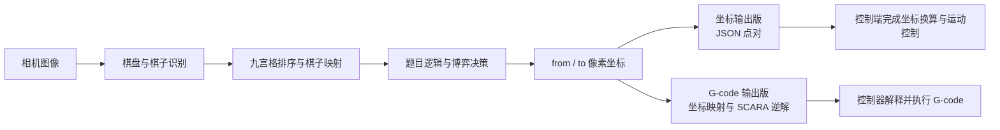

# 2024 三子棋参考代码：坐标输出与 G-code 输出

> 这是对 2024 年往年题目的参考实现，不是本人 2024 年的参赛项目。目录保留了当时形成的两套完整思路，用来比较视觉端与控制端可以怎样划分职责。

这个项目的前半段基本相同：相机先找到九宫格和黑白棋子，再把棋子映射到逻辑棋盘，题目逻辑最后给出一次移动的起点 `from` 和终点 `to`。两版真正不同的地方不在识别算法，而在于视觉端计算到哪一步才停止。

## 两个版本分别解决什么问题

### [笛卡尔坐标系移动控制](笛卡尔坐标系移动控制/README.md)

这一版把视觉结果整理成 `from`、`to` 两个坐标，通过 JSON 发送给控制端。坐标可以继续保持为像素坐标，也可以在发送前做偏移或方向修正；机械结构的运动学换算、轨迹规划和执行仍由控制端负责。

适合观察：

- 视觉端怎样把“拿哪颗棋、放到哪一格”转换成两个点；
- 图像坐标与控制端坐标之间怎样约定方向、原点和偏移；
- 为什么只发送坐标时，视觉程序不需要知道机械臂的连杆长度或关节角。

### [G-Code 控制逻辑](G-Code控制逻辑/README.md)

这一版继续在视觉端处理 `from`、`to`：先把像素坐标线性映射到实际工作范围，再根据 SCARA 大臂、小臂参数计算关节角，生成取棋、移动、放棋和回零所需的 G-code，最后逐行通过串口发送。

适合观察：

- 像素坐标怎样进入实际坐标和机械坐标；
- SCARA 逆运动学怎样接在视觉结果之后；
- 一次 `from → to` 动作怎样展开成多行 G-code；
- 视觉端直接生成动作命令后，会额外承担哪些标定和机械参数责任。

## 两版共享的数据流

两套代码虽然保存于不同子目录，但核心问题一致：

1. 识别并排序九宫格中心，建立编号稳定的 3×3 棋盘。
2. 找到黑白棋子中心，并按最近位置映射到逻辑棋盘。
3. 根据收到的题目指令，选择放置、纠错或人机博弈逻辑。
4. 把逻辑落子位置重新转换成画面中的实际点位。
5. 生成 `{"from": [x1, y1], "to": [x2, y2]}` 形式的一次移动结果。
6. 在发送层分叉：坐标版直接交付点对，G-code 版继续生成机械动作命令。

因此，不要把两个目录中的同名文件随意混用。它们记录的是两套已经各自连通的实现，同名模块也可能包含不同的识别方式、模型调用、参数和发送流程。

## 应该选择哪一版阅读

- 想先理解视觉与控制怎样解耦，从[坐标输出版](笛卡尔坐标系移动控制/README.md)开始。重点看 `topic_request.py → my_utils.py`：前者产生点对，后者完成坐标修正和 JSON 发送。
- 想理解视觉端怎样直接交付动作命令，再读 [G-code 输出版](G-Code控制逻辑/README.md)。重点看 `my_utils.py → gcode_generator.py`：前者组织一次拿放动作，后者完成坐标映射、逆解和命令生成。
- 想比较两种系统边界，可以先找到两版中的 `sending_coordinate_data()`。函数名相同，但坐标版在 JSON 发送处结束，G-code 版会继续调用生成器。

## 运行边界

这些文件保留了对应时期的 MaixPy API、模型路径、串口设备、相机裁剪范围、像素范围、机械尺寸和现场参数。完整运行需要与当时相匹配的 MaixCAM 环境、模型文件、控制器固件和机械结构；不能仅凭 PC 上的 Python 语法检查判断机械动作正确。

特别要注意：

- 坐标版与 G-code 版的串口输出不是同一种协议，控制端必须与所选版本匹配。
- G-code 版中的 `M150`、`G92`、角度模式等行为与控制器固件约定有关，不应当作所有 CNC 或 3D 打印机固件都支持的通用命令。
- 更换相机分辨率、裁剪区域、安装方向、工作平面、SCARA 连杆或机械原点后，都需要重新核对标定参数。
- 历史代码中的参数用于还原实现思路，不代表已经在当前设备与固件组合上重新验收。

## 继续学习

- [串口数据格式：字符串、JSON 与二进制帧](../../../学习路线/05-数据传输、G-code与系统协同/01-串口数据格式.md)
- [G-code 视觉侧接口](../../../学习路线/05-数据传输、G-code与系统协同/02-G-code视觉侧接口.md)
- [历年题目参考代码索引](../README.md)
